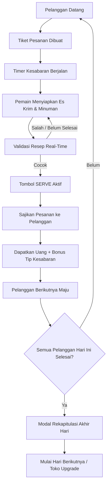
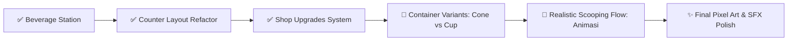

# 🍨 CREAMY SUNDAE — MASTER HANDOVER & PROJECT INHERITANCE

> **Dokumen Harta Waris & Panduan Transisi Project**  
> Dibuat untuk mewariskan konteks penuh, arsitektur teknis, status pengerjaan, dan blueprint masa depan project **Creamy Sundae** kepada AI Agent berikutnya atau environment VPS baru.

---

## 📌 1. EXECUTIVE SUMMARY & IDENTITAS PROJECT

| Properti | Detail |
|---|---|
| **Nama Project** | Creamy Sundae |
| **Genre** | 2D Casual Cooking / Time-Management / Ice Cream Shop Simulation |
| **Target Platform** | Web Browser (Desktop & Mobile / Touchscreen Responsive) |
| **Game Engine** | Phaser 4.0.0 |
| **Bundler & Dev Server** | Vite 6.3.x |
| **Bahasa Pemrograman** | JavaScript (Modern ES Modules) |
| **Repository Git** | [https://github.com/RizkyNs/creamy-sundae](https://github.com/RizkyNs/creamy-sundae) |
| **Branch Utama** | `main` |
| **Environment Resmi** | VPS Linux Ubuntu 24.04 LTS (`/root/creamy-sundae`) |
| **Primary Coding Agent** | Antigravity CLI (`agy`) |

---

## 🎯 2. CORE GAMEPLAY LOOP & FILOSOFI DESAIN

Game ini dirancang untuk memberikan pengalaman mengelola gerai es krim (*ice cream stand / shop*) yang dinamis, cepat, dan memuaskan.



### Prinsip Utama:
1. **Data State adalah Source of Truth**: UI dan visual hanyalah representasi dari data (`this.cupContents`, `this.drinkContent`, `this.currentOrder`). Jangan pernah mengandalkan teks UI sebagai logika bisnis game.
2. **Prototype Berbasis Bentuk Dasar (Phaser Shapes)**: Sebelum aset pixel art final diintegrasikan, visual game dibangun menggunakan `rectangle`, `circle`, dan `text` agar seluruh mekanik logika teruji solid tanpa hambatan aset.

---

## 🌐 3. ENVIRONMENT, NETWORK & RUNTIME

### VPS Server Environment
- **OS**: Ubuntu 24.04 LTS (x86_64)
- **Project Directory**: `/root/creamy-sundae`
- **Node.js & npm**: Terinstall dan dikonfigurasi pada environment VPS.
- **Antigravity CLI**: Terpasang di `/root/.local/bin/agy` (v1.1.20).

### Network & Port Mapping
- **VPS Private IP**: `192.168.11.168`
- **VPS Public IP**: `139.99.122.214`
- **NAT Mapping**: Port Publik `20043` ➔ Port Internal VPS `8080` (TCP).
- **Public URL Pengujian**: `http://139.99.122.214:20043`

### Command Operasional Standar
```bash
# 1. Masuk ke direktori project
cd /root/creamy-sundae

# 2. Install dependencies (jika di VPS baru)
npm install

# 3. Menjalankan Development Server (wajib bind 0.0.0.0 dan port 8080)
npm run dev -- --host 0.0.0.0 --port 8080

# 4. Build Produksi (wajib lolos exit code 0 sebelum commit)
npm run build
```

> [!WARNING]
> **Larangan Environment Termux/Android**: Jangan jadikan Termux Android sebagai build environment utama karena Rollup native module (`@rollup/rollup-android-arm64`) bermasalah dengan runtime linker Termux. VPS Linux Ubuntu adalah environment resmi.

---

## 🏗️ 4. STRUKTUR CODEBASE & ARSITEKTUR FILE

```
creamy-sundae/
├── public/
│   ├── assets/
│   │   ├── bg.png
│   │   └── logo.png
│   │   └── ASSET_GUIDELINES.md
│   ├── favicon.png
│   └── style.css
├── src/
│   ├── main.js                  # Entry point bundler Vite & style import
│   └── game/
│       ├── main.js              # Konfigurasi Phaser.Game (Scale: 1024x768, AUTO, Scene list)
│       ├── data/assets.js        # Registry asset runtime/Phaser keys
│       └── scenes/
│           ├── Boot.js          # Bootstrapping awal Phaser
│           ├── Preloader.js     # Loading bar & asset preloader
│           ├── MainMenu.js      # Menu utama & tombol START DAY
│           ├── Game.js          # Core gameplay scene (semua logika toko)
│           └── GameOver.js      # Game over scene
├── media-context/               # Folder referensi media (di-ignore oleh Git)
│   └── dummy gameplay.png       # Mockup pixel art target visual & tata letak toko
├── vite/
│   ├── config.dev.mjs           # Konfigurasi Vite dev server
│   └── config.prod.mjs          # Konfigurasi Vite production build (Terser minification)
├── AGENTS.md                    # Rule book & dynamic checklist coding agent
├── assets-work/                 # Prompt, reviewed/processed staging dan panduan asset
├── scripts/check-assets.mjs     # Validasi registry dan image runtime
├── HANDOVER.md                  # Dokumen master serah terima teknis (dokumen ini)
├── SESSION_CONTEXT.md           # Rangkuman kronologis dan konteks riwayat percakapan
├── index.html                   # HTML container game canvas
├── package.json                 # Metadata package (Phaser 4.0.0, Vite 6.3.1, Terser 5.39.0)
├── package-lock.json            # Lockfile dependensi resmi
├── log.js                       # Logger telemetry Phaser
└── .gitignore                   # Ignore rules (node_modules, dist, .env, media-context)
```

---

## 🎮 5. DETAIL SISTEM GAMEPLAY YANG SUDAH SELESAI (`Game.js`)

Semua fitur di bawah ini sudah diimplementasikan sebagai prototype di `Game.js` dan build production saat audit terakhir berhasil. Pengujian gameplay manual dan angka desain final masih perlu dilakukan sebelum fitur dianggap production-ready:

### A. Shop Counter Layout & Visual Zones
- **Top Bar (y: 35)**: Menampilkan judul game `CREAMY SUNDAE`, indikator hari `DAY X`, dan saldo `this.money` (hijau).
- **Customer Area (Kiri Atas - x: 140, y: 175)**: Avatar pelanggan, nama customer, dan meteran kesabaran (bar + persentase).
- **Order Ticket (Tengah Atas - x: 460, y: 205)**: Tiket bergaris tegas menampilkan rincian: nama pesanan, daftar scoop es krim, dan jenis minuman.
- **Status & Action (Kanan Atas - x: 820, y: 150..225)**: Teks status validasi resep dan tombol interaktif **SERVE ORDER**.
- **Counter Table (Bawah - y: 335..768)**:
  - **Ice Cream Display Case (x: 350, y: 545)**: 3 bak es krim (`VANILLA`, `CHOCOLATE`, `STRAWBERRY`) berdampingan di atas slot perakitan `CUP` (x: 350, y: 620).
  - **Soda Fountain (x: 820, y: 545)**: Tombol dispenser `COLA` & `LEMON`, slot gelas minuman (x: 810, y: 615), dan tombol pembatalan/clear `✕`.

### B. Mekanik Interaksi Scoop (Drag & Drop)
- Menekan bak es krim memunculkan scoop di posisi bak tersebut.
- Pemain menarik (*drag*) scoop ke arah slot `CUP`.
- Jika dilepas dalam radius cup (<90px), scoop otomatis terkunci (*draggable false*), dimasukkan ke `this.cupContents` dan `this.cupScoopObjects`, serta tersusun rapi (*stacked*) di dalam cup.
- Jika dilepas di luar cup, scoop otomatis dihancurkan (`destroy()`).

### C. Station Minuman (Soda Dispenser)
- Tombol **COLA** menuangkan cairan cokelat gelap ke dalam gelas minuman.
- Tombol **LEMON** menuangkan cairan kuning cerah ke dalam gelas minuman.
- Status minuman disimpan dalam variabel state `this.drinkContent` (`'cola'`, `'lemon'`, atau `null`).
- Tombol **✕ (Clear)** memungkinkan pemain membuang isi gelas jika salah menuang.

### D. Sistem Validasi Resep Real-Time (`validateRecipe()`)
- Memvalidasi susunan scoop dalam cup terhadap `this.currentOrder.scoops`.
- Memvalidasi jenis minuman dalam gelas terhadap `this.currentOrder.drink`.
- Status dinamis:
  - `KEEP BUILDING` (Cokelat): Pesanan masih kurang/belum lengkap.
  - `ORDER READY` (Hijau): Isi cup dan minuman 100% cocok dengan pesanan pelanggan.
  - `WRONG ORDER` (Merah): Bahan salah atau berlebih.

### E. Sistem Kesabaran & Bonus Tip (`update(time, delta)`)
- Setiap pelanggan memiliki nilai `maxPatience` (15–35 detik tergantung hari).
- Meteran kesabaran berkurang secara time-based (*delta*).
- Warna bar berubah adaptif: Hijau (>50%) ➔ Oranye (25–50%) ➔ Merah (<25%).
- **Bonus Pelayanan Cepat**:
  - Kesabaran > 70%: Bonus tip **+$1.00**.
  - Kesabaran 40–70%: Bonus tip **+$0.50**.
- **Customer Kehabisan Waktu**: Jika kesabaran mencapai 0%, layar bergetar (*camera shake*), pelanggan berubah merah, isi cup/minuman dibersihkan, dicatat ke `dayLostCount`, lalu pelanggan pergi dan antrean berganti.

### F. Antrean Pelanggan & Siklus Hari (`startDay()`, `endDay()`)
- Pelanggan dibuat secara prosedural per hari (`generateCustomerQueue(day)`).
- Menghasilkan variasi pesanan: Es krim tunggal, Minuman saja, atau Paket Combo (Duo/Trio scoop + Minuman).
- **End of Day Summary Modal**: Saat semua pelanggan selesai, muncul modal dialog rekapitulasi:
  - *Customers Served*
  - *Customers Lost*
  - *Day Earnings*
  - *Tips Received*
  - *Total Savings*
  - Tombol **START DAY [X+1]** untuk lanjut ke hari berikutnya.

### Batasan kondisi saat ini
- Saldo, hari, antrean, dan upgrade belum disimpan ke local storage atau backend; state di-reset saat scene/game dimulai ulang.
- Harga, jumlah customer, durasi patience, dan nilai progresi lain adalah **temporary prototype values**.
- Logika gameplay masih terkonsentrasi di `Game.js`; belum ada modul systems/data/objects terpisah.
- `GameOver.js` masih merupakan scene template dan belum menjadi bagian dari alur normal hari.

---

## 🧰 6. ASSET PIPELINE

- Registry terpusat: `src/game/data/assets.js` (key, path, type, kategori, status, sumber, lisensi).
- `Preloader.js` memuat image yang terdaftar di registry.
- `npm run assets:check` memeriksa keberadaan file, duplikasi key, format/dimensi image, dan file runtime yang belum didaftarkan.
- Tooling: `sharp` untuk inspeksi image dan `fast-glob` untuk discovery file.
- `assets-work/raw/` dan `assets-work/rejected/` di-ignore oleh Git; hanya asset yang sudah direview dan disetujui dipindahkan ke `public/assets/`.
- Standar visual, format, dimensi awal, penamaan, dan provenance ada di `public/assets/ASSET_GUIDELINES.md`.
- Asset registry saat ini berisi `bg.png` (1024x768), `logo.png` (500x108), serta prototype-approved `container-paper-cup` (PNG 96x112) dan `ingredient-vanilla-scoop` (PNG 96x96), yang sudah digunakan untuk cup dan scoop Vanilla di gameplay. Chocolate dan Strawberry masih menggunakan placeholder bentuk dasar. Asset final, sprite sheet, dan animasi belum dibuat.
- Referensi visual Gemini yang diunggah user berada di `assets-work/prompts/` dan diperlakukan sebagai preference references, bukan asset final. Aturan hasil terjemahan visual ada di `assets-work/prompts/STYLE_GUIDE.md`.
- Karakter pada referensi belum final; role, nama, proporsi, ukuran sprite, dan state animasi masih terbuka.

## 📊 7. AUDIT STATUS & ROADMAP

Audit dokumentasi terakhir: 28 September 2026. Shop upgrades kemudian diimplementasikan pada sesi yang sama. `npm run build` harus dijalankan sebelum commit fitur tersebut.

## 🗺️ 8. ROADMAP & TARGET PENGERJAAN BERIKUTNYA



### ✅ Shop Upgrades System — Implemented
- Modal upgrade tersedia pada End of Day Summary.
- **Patient Customers**: biaya prototype `$10`, menambah 5 detik patience per level, maksimum level 2.
- **Charming Service**: biaya prototype `$15`, menambah 25% nilai tip per level, maksimum level 2.
- **Shop Decor**: biaya prototype `$20`, mengubah warna counter, maksimum level 1.
- Pembelian mengurangi `this.money`, memperbarui saldo, dan efek langsung diterapkan ke customer berikutnya atau reward berikutnya.
- Nilai biaya, efek, dan level adalah **temporary prototype values**; upgrade belum disimpan antar sesi.

### 🎯 Next Immediate Task: **Container Variants: Cone vs Cup**
Pilihan wadah perlu masuk ke data order, state penyajian, dan validasi resep sebelum alur scooping realistis dibuat.

### 🔮 Planned Future Mechanics (Pengerjaan Masa Depan):
1. **Realistic Scooping Flow (Alur Sekop Realistis)**:
   - Pemain memegang alat sekop (*scooper*).
   - Sekop diarahkan ke bak es krim ➔ Animasi menyekop es krim.
   - Sekop yang terisi diarahkan ke wadah (Waffle Cone atau Cup) ➔ Animasi menaruh es krim.
   *(Dikerjakan setelah aset visual/animasi siap)*.
2. **Pilihan Wadah (Cone vs Cup)**:
   - Pelanggan dapat memesan es krim di dalam Waffle Cone atau Cup kertas.
3. **Topping & Saus**:
   - Taburan sprinkles, cherry, sirup cokelat, saus stroberi.
4. **Audio & Polish Visual**:
   - Integrasi SFX (scooping, pouring soda, cash register coin, customer mood sound).
   - Integrasi sprite Pixel Art final berdasarkan referensi `media-context/dummy gameplay.png`.

---

## 📜 9. ATURAN WAJIB BAGI DEVELOPER / AI AGENT PENERUS

1. **Selalu Baca File Sebelum Mengedit**: Jangan berasumsi tentang isi file. Gunakan tool pembaca file untuk memeriksa kondisi aktual kode.
2. **Pelihara Kode yang Bekerja**: Jangan merombak kode secara besar-besaran (*burn & rewrite*) kecuali ada alasan teknis yang kuat.
3. **Wajib Build Sebelum Selesai**: Jalankan `npm run build` dan pastikan `exit code 0` sebelum melakukan commit atau mengakhiri turn.
4. **Wajib Memperbarui Dokumen Pewarisan Secara Dinamis (CRITICAL)**:
   - Setiap kali ada fitur baru, perubahan logika, refactoring, atau perubahan alur pengerjaan pada project, **AI/Developer WAJIB memperbarui 3 file dokumentasi**:
     - `AGENTS.md` (Checklist milestone & status tugas saat ini)
     - `HANDOVER.md` (Arsitektur teknis, sistem selesai, dan roadmap)
     - `SESSION_CONTEXT.md` (Riwayat kronologis keputusan desain & status sesi)
   - Hal ini bertujuan agar seluruh dokumentasi project **selalu relevan, up-to-date, dan tidak pernah basi** di environment manapun dan oleh AI manapun.
5. **Keamanan & Secrets**: JANGAN PERNAH men-commit file `.env`, Personal Access Token (PAT), password VPS, atau kredensial sensitif ke dalam Git.
6. **Git Push**: Karena batasan autentikasi remote tanpa terminal interaktif, lakukan `git add` dan `git commit` di lokal, dan biarkan user melakukan `git push` secara manual (atau gunakan flow autentikasi yang sah).

---

*Creamy Sundae siap untuk dilanjutkan ke tahap berikutnya!* 🍨🚀
